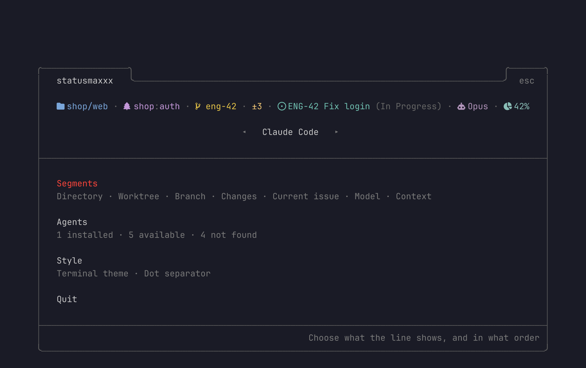
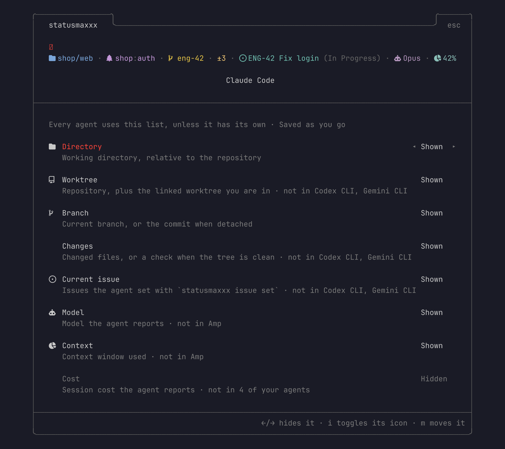
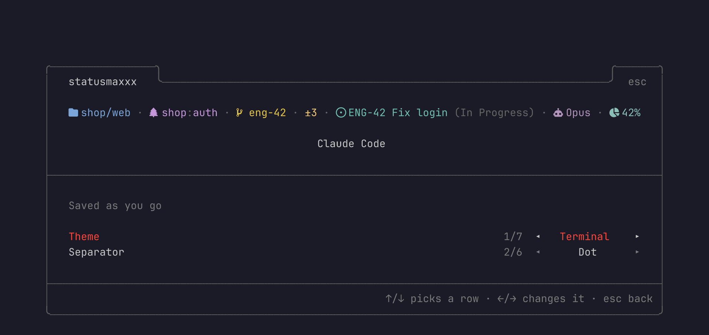
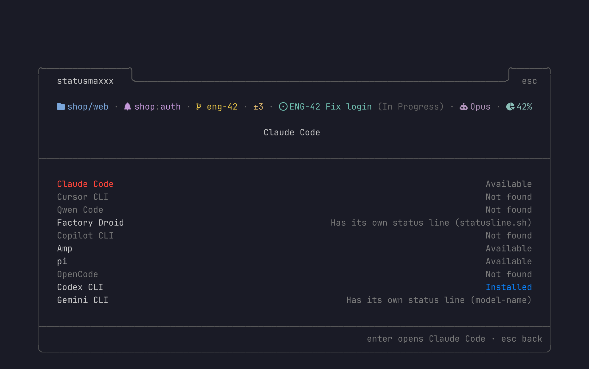

# statusmaxxx

[](https://github.com/kumamaki/statusmaxxx/actions/workflows/ci.yml)


One status line for every coding agent. You configure it once, and each agent shows the same segments: directory, worktree, branch, changes, the issue the agent is working on, model, context, and cost.

## Install

From source, until the first release is out:

```sh
git clone https://github.com/kumamaki/statusmaxxx && cd statusmaxxx
just install            # cargo install → ~/.cargo/bin/statusmaxxx
```

Once a release is published:

```sh
curl --proto '=https' --tlsv1.2 -LsSf https://github.com/kumamaki/statusmaxxx/releases/latest/download/statusmaxxx-installer.sh | sh
```

Install the binary before installing into agents: each agent runs the binary that installed it.

Icons need a [Nerd Font](https://www.nerdfonts.com). Turn each one on or off with `i` on the Segments screen, or list them in `icons` in the config.

## Use

```sh
statusmaxxx                   # TUI: segments, agents, style; changes save as you make them
statusmaxxx install claude amp
statusmaxxx status
statusmaxxx uninstall amp
```

`install` saves whatever status line it replaces, and `uninstall` puts it back. Every settings file it edits also gets a `<file>.statusmaxxx.bak` copy. `install` also tells the agent to keep its issue current (see [Issues](#issues)), and `uninstall` removes that too. Start a new agent session after installing.

## TUI

`statusmaxxx` opens a card with a live preview of the line at the top. The preview uses a made-up repository and issue, so every segment you turn on shows something; the real line reads your worktree. Every change is saved as you make it.



| Screen | Keys |
|---|---|
| Home | `←/→` switches which agent the preview shows |
| Segments | `←/→` or `space` shows or hides a segment, `m` picks it up to move with `↑/↓` (`enter` puts it down), `i` turns its icon on or off. `↴` in the preview marks the focused segment |
| Agents | Install, Uninstall, and whether the agent uses the shared segment list or its own (`←/→`) |
| Style | Theme and separator (`↑/↓` picks the row, `←/→` changes it) |

`esc` goes back, `q` quits.





## Agents



| Agent | How it hooks in | What it edits |
|---|---|---|
| Claude Code | `statusLine` command | `~/.claude/settings.json` |
| Cursor CLI | `statusLine` command (replaces Cursor's footer) | `~/.cursor/cli-config.json` |
| Qwen Code | `ui.statusLine` command | `~/.qwen/settings.json` |
| Factory Droid | `statusLine` command | `~/.factory/settings.json` |
| Copilot CLI | `statusLine` command + `footer.showCustom` | `~/.copilot/settings.json` |
| Amp | plugin on the experimental status item API | `~/.config/amp/plugins/statusmaxxx.ts` |
| pi | extension status in the footer | `~/.pi/agent/extensions/statusmaxxx.ts` |
| OpenCode | TUI plugin in the `app_bottom` slot | `~/.config/opencode/tui.json`, `tui-plugins/` |
| Codex CLI | its own `tui.status_line` items | `~/.codex/config.toml` |
| Gemini CLI | its own `ui.footer.items` | `~/.gemini/settings.json` |

Codex and Gemini cannot show custom text, so they only get the segments they have an item for. For them, worktree, changes, and issue are not available.

Checked against the real agent: Claude Code, Cursor, Droid, Amp, pi, and Codex. Qwen, Copilot, OpenCode, and Gemini follow their docs and have not been run yet; if one shows nothing, please open an issue.

The other agents read the config on every refresh, so changes show right away. Codex and Gemini keep their own copy of the item list; the TUI rewrites it whenever you change segments, as long as it is still the list statusmaxxx wrote. A list you edited by hand is left alone. After editing `config.toml` by hand, run `statusmaxxx install codex gemini` again.

Command agents run a small wrapper script in `~/.config/statusmaxxx/hosts/`. It calls `statusmaxxx render --host <agent>` with the session JSON on stdin. Plugin agents run a generated shim that calls the same command.

## Issues

The agent knows which issue it is working on, because it read it from the tracker, so it sets the issue itself:

```sh
statusmaxxx issue set ENG-42 "Fix the auth flow" --state "In Progress" --url https://linear.app/…
statusmaxxx issue set ENG-42 --state "In Review"     # fields left out keep their value
statusmaxxx issue add ENG-43                          # more than one issue
statusmaxxx issue clear                               # or: clear ENG-43
statusmaxxx issue show
```

Issues are kept per worktree, in that worktree's own git dir. They survive restarts, every linked worktree has its own list, and nothing shows up in `git status`. Any tracker works: the id is just text.

`install` teaches the agent to do this, at the points where it matters:

| Agent | How it hears about it |
|---|---|
| Claude Code, Qwen, Droid | `SessionStart` hook in their `settings.json` |
| Cursor CLI | `sessionStart` hook in `~/.cursor/hooks.json` |
| Copilot CLI | `sessionStart` hook in `~/.copilot/hooks/statusmaxxx.json` |
| Amp, pi, OpenCode | marked block in their global `AGENTS.md` |

The hook runs at startup, on resume, and after compaction. It tells the agent what this worktree shows (`ENG-42 "Fix auth" (In Progress)`), or that nothing is set, and how to update it. Try it with `echo '{"cwd":"'$PWD'"}' | statusmaxxx hook session-start --host claude`.

## Config

`~/.config/statusmaxxx/config.toml`, written by the TUI:

```toml
segments = ["directory", "worktree", "branch", "changes", "issue", "model", "context"]
theme = "terminal"          # terminal, short-giraffe, catppuccin, dracula, nord, gruvbox, light
icons = ["directory", "worktree", "branch", "issue", "model", "context"]   # or true / false for all / none
separator = " · "           # any text; the TUI offers "  ", " · ", " │ ", " | ", " › ", " / "

[hosts.amp]                 # Amp shows its own model, so it gets its own list
segments = ["worktree", "branch", "issue"]
```

Segments: `directory`, `worktree`, `branch`, `changes`, `issue`, `model`, `context`, `cost`. `git` also works and means `branch` and `changes`. When an agent does not send something (Droid has no cost, for example), that segment stays empty.

## Debugging

A segment that fails shows `✗ <segment>` and writes the reason to stderr. To see it, replay the last session an agent sent:

```sh
statusmaxxx render --host claude < ~/.cache/statusmaxxx/payloads/claude.json
```

`render` records every payload it receives in that file, so piping in hand-written JSON replaces the recorded session until the agent refreshes again.

## License

[WTFPL](LICENSE)
